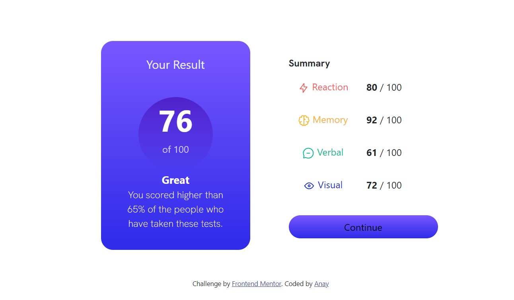

# Frontend Mentor - Results summary component solution

This is a solution to the [Results summary component challenge on Frontend Mentor](https://www.frontendmentor.io/challenges/results-summary-component-CE_K6s0maV). Frontend Mentor challenges help you improve your coding skills by building realistic projects. 

## Table of contents

- [Overview](#overview)
  - [The challenge](#the-challenge)
  - [Screenshot](#screenshot)
  - [Links](#links)
- [My process](#my-process)
  - [Built with](#built-with)
  - [What I learned](#what-i-learned)
  - [Useful resources](#useful-resources)
- [Author](#author)

## Overview

### The challenge

Users should be able to:

- View the optimal layout for the interface depending on their device's screen size
- See hover and focus states for all interactive elements on the page

### Screenshot

### Links

- Live Site URL: [https://anay028.github.io/results-summary-component/](https://anay028.github.io/results-summary-component/)

## My process

### Built with

- [Bootstrap 5.3](https://getbootstrap.com/docs/5.3/getting-started/introduction/)
- CSS custom properties
- flex display

### What I learned

I learned lot of things like how to add gradient to backgrounds which was very useful for me. I also learned how to create circles which is gonna be very useful for me in future

### Useful resources

- [w3schools](https://www.w3schools.com/) - This helped me in creating circles in css
- [Bootstrap layouts](https://getbootstrap.com/docs/5.3/layout/) - This helped me create columns to optimize it for mobile.

## Author

- Website - [Anay](https://anay.is-a.dev/)
- Frontend Mentor - [@Anay028](https://www.frontendmentor.io/profile/Anay028)

